# ***** - (Prototype)

Monorepo for a **Next.js** marketing and portfolio site backed by **Sanity**. The public site showcases sourcecode projects, sanity CMS, Stripe Checkout, Site Analytics, System Monitoring, Resume Download, Jobs Crawler, and paid source-code offerings. The same Next.js app embeds **Sanity Studio** with custom dashboards for analytics, job aggregation, geography seeding, and company crawling—all stored in the Sanity dataset.

## Repository layout

| Path | Role |
|------|------|
| [`frontend/`](frontend/) | Next.js 15 (App Router), public pages, API routes, embedded Studio UI |
| [`studio/`](studio/) | Sanity Studio package (schemas, can run standalone with `sanity dev`) |
| [`docs/`](docs/) | Architecture, data model, API, and operations documentation |

The root [`package.json`](package.json) uses npm workspaces so you can run both apps from the repo root.

## Features (high level)

- **Public site**: Home (GitHub activity, source code listings, testimonials, stacks), experience, contact, terms; Stripe checkout.
- **Content**: Sanity documents for source code, files, images, and site settings; presentation/visual editing support where configured.
- **Jobs module**: Crawlers pull from multiple APIs (Remotive, Arbeitnow, Adzuna, The Muse, USAJOBS, RemoteOK), RSS/Atom feeds, and Greenhouse-style boards; optional SerpApi for location-aware runs; results stored as `jobListing` and related types.
- **Geography & companies**: Countries and cities (ISO + OpenStreetMap via Overpass), optional seed runs; company records derived from job data with crawl run history.
- **Analytics & monitoring**: Page views, user events, client performance and error reporting, system metrics; admin dashboards in Studio.
- **Studio access**: Optional custom URL path and HTTP-only cookie auth so `/studio` can be hidden in production.

Detailed behavior, schemas, and API tables live in **[`docs/`](docs/)**.

## Screenshot gallery

Browse the UI quickly below. Click any thumbnail to open the full-size image.

| Screen 01 | Screen 02 | Screen 03 |
|---|---|---|
| [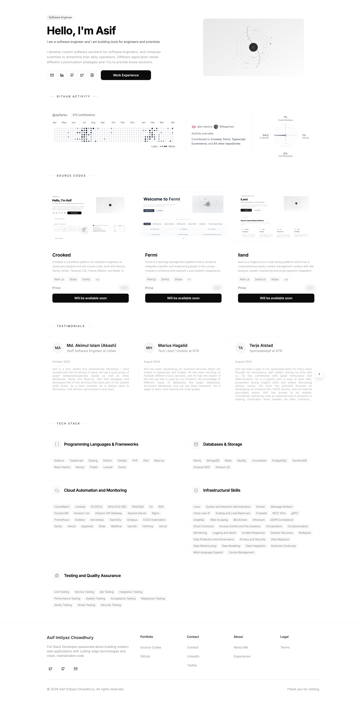](./screenshots/1.png) | [](./screenshots/2.png) | [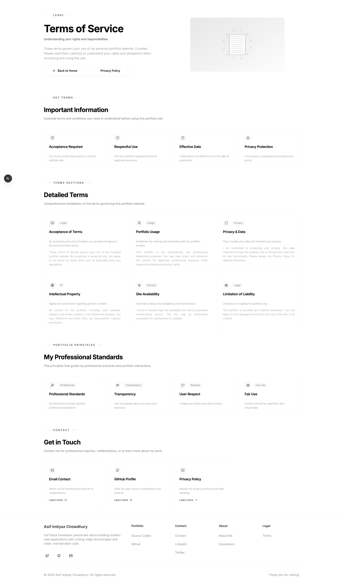](./screenshots/3.png) |

| Screen 04 | Screen 05 | Screen 06 |
|---|---|---|
| [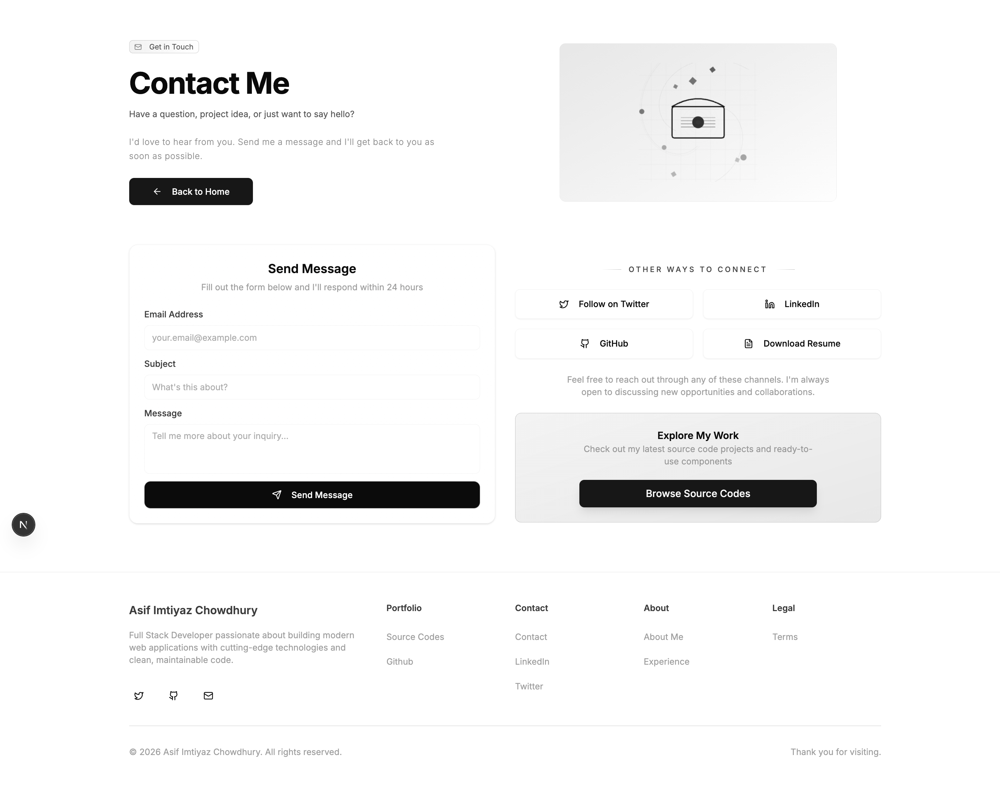](./screenshots/4.png) | [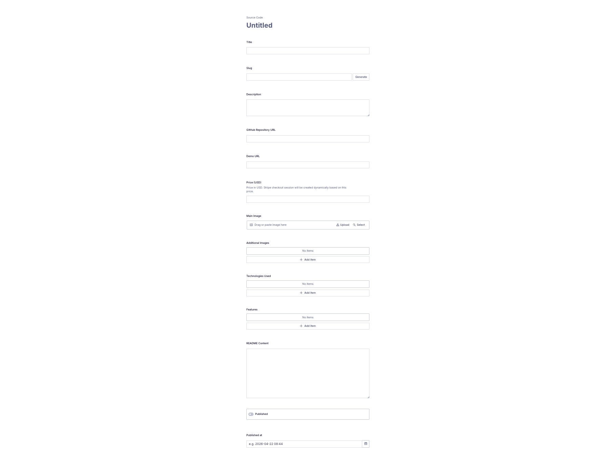](./screenshots/5.png) | [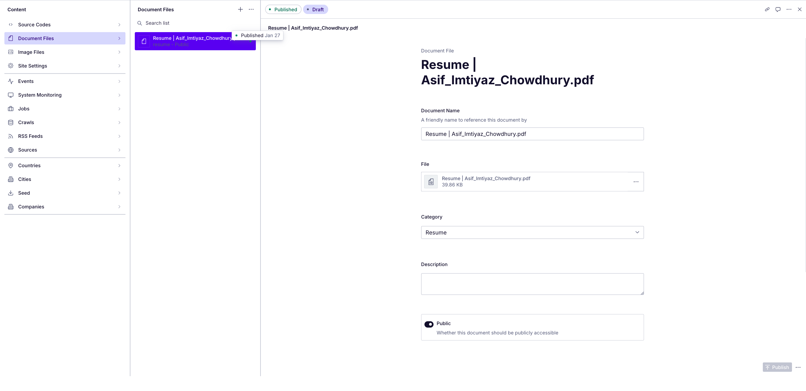](./screenshots/6.png) |

| Screen 07 | Screen 08 | Screen 09 |
|---|---|---|
| [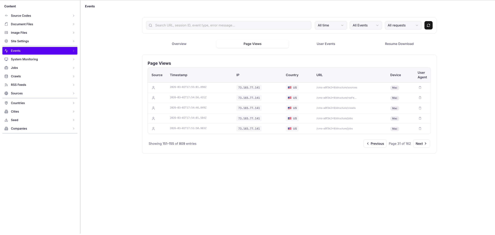](./screenshots/7.png) | [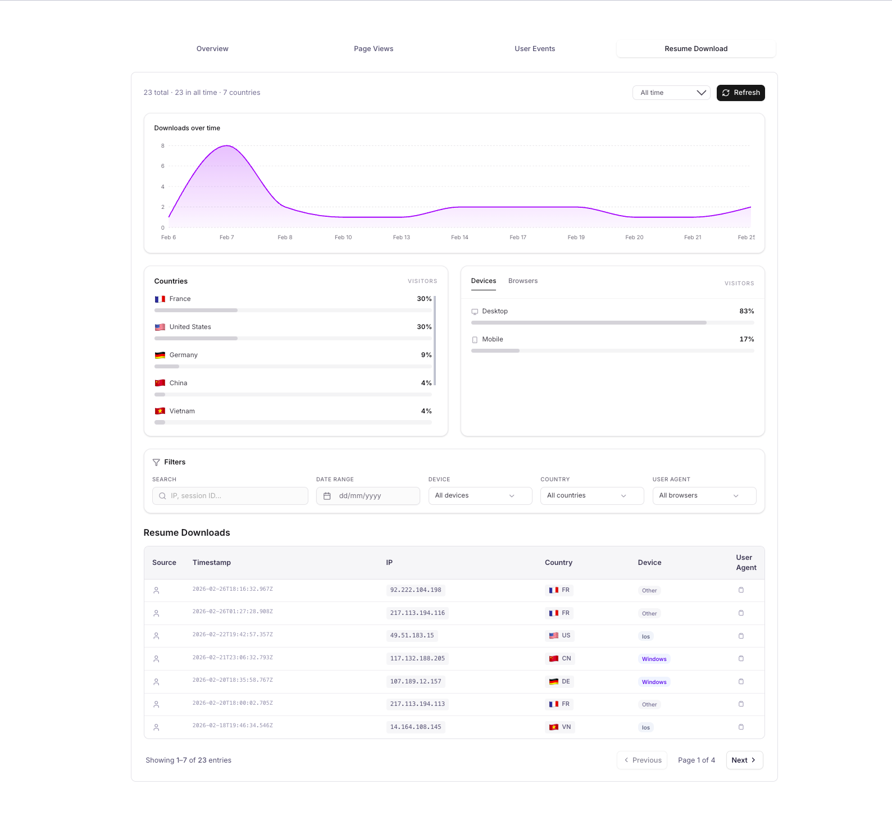](./screenshots/8.png) | [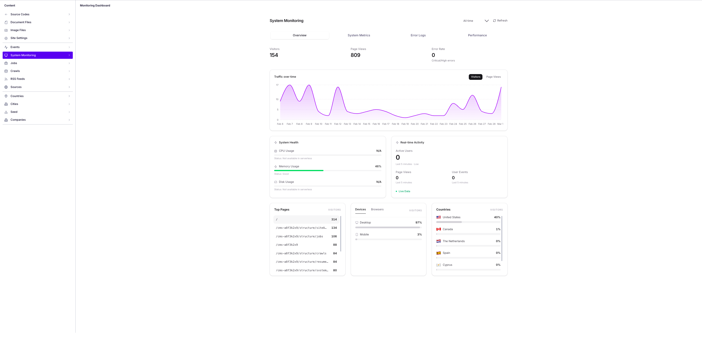](./screenshots/9.png) |

| Screen 10 | Screen 11 | Screen 12 |
|---|---|---|
| [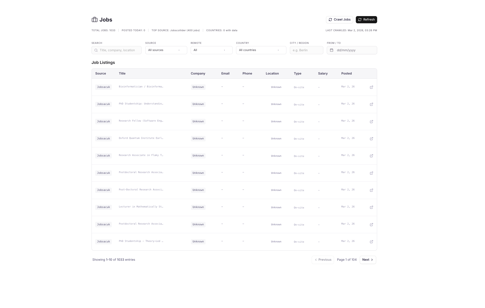](./screenshots/10.png) | [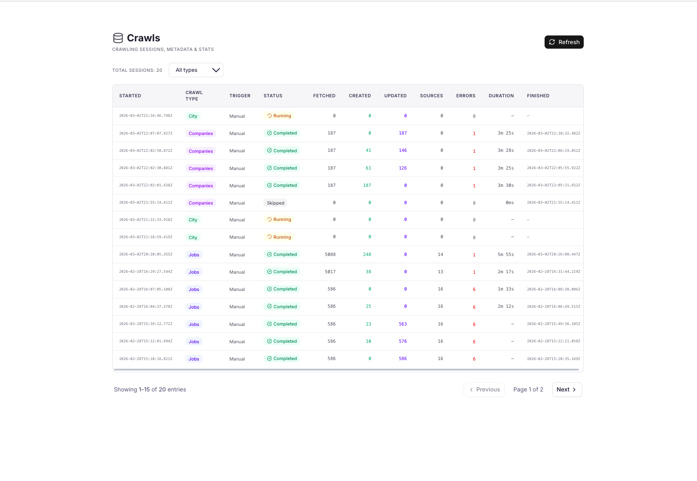](./screenshots/11.png) | [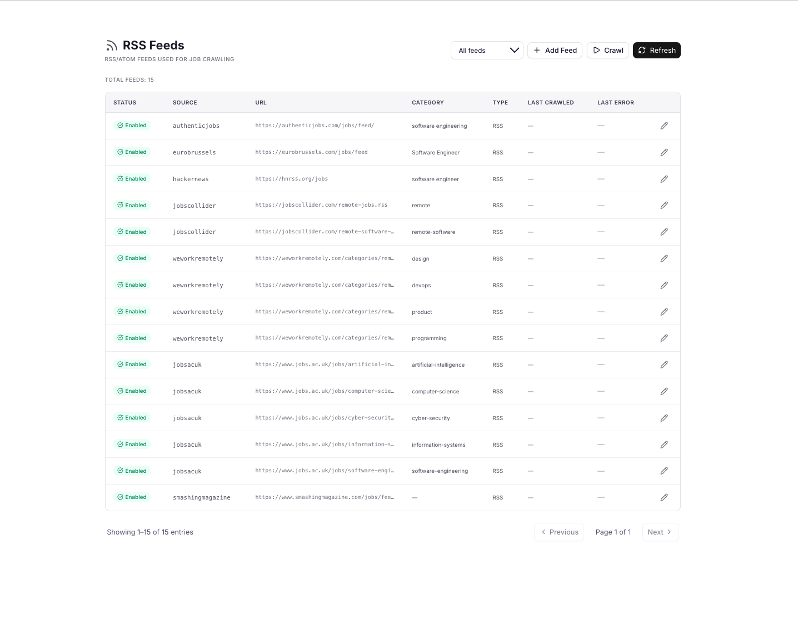](./screenshots/12.png) |

| Screen 13 | Screen 14 | Screen 15 |
|---|---|---|
| [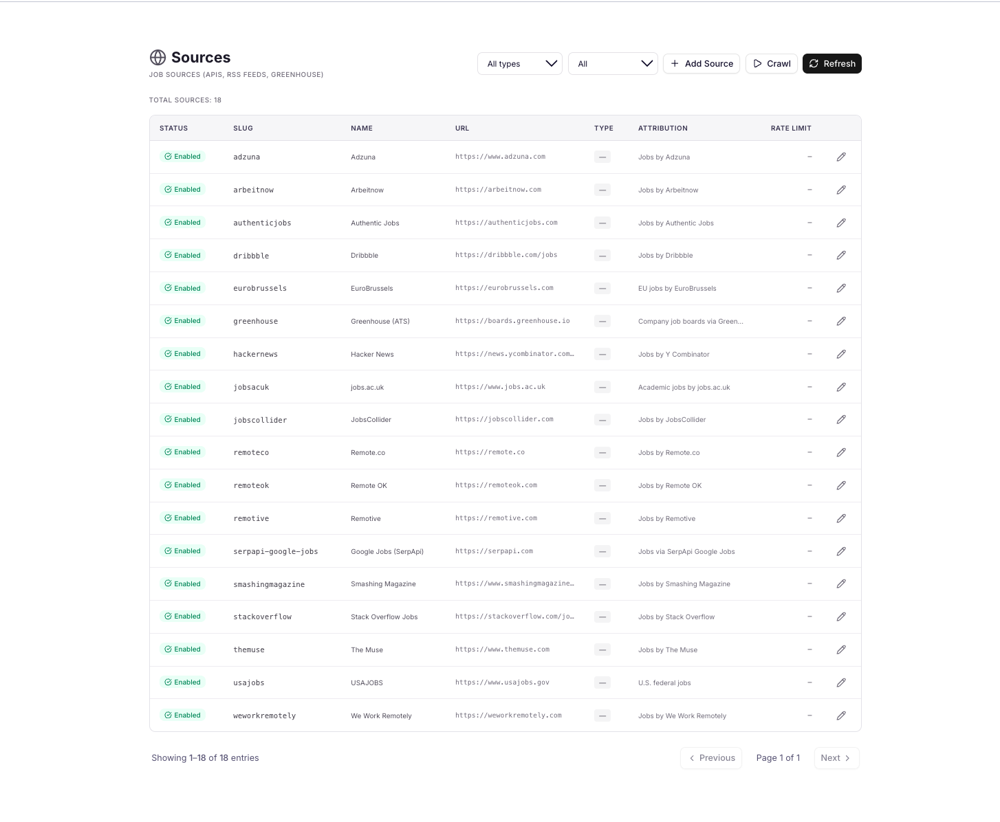](./screenshots/13.png) | [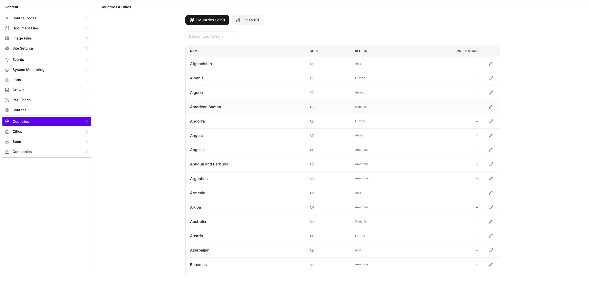](./screenshots/14.png) | [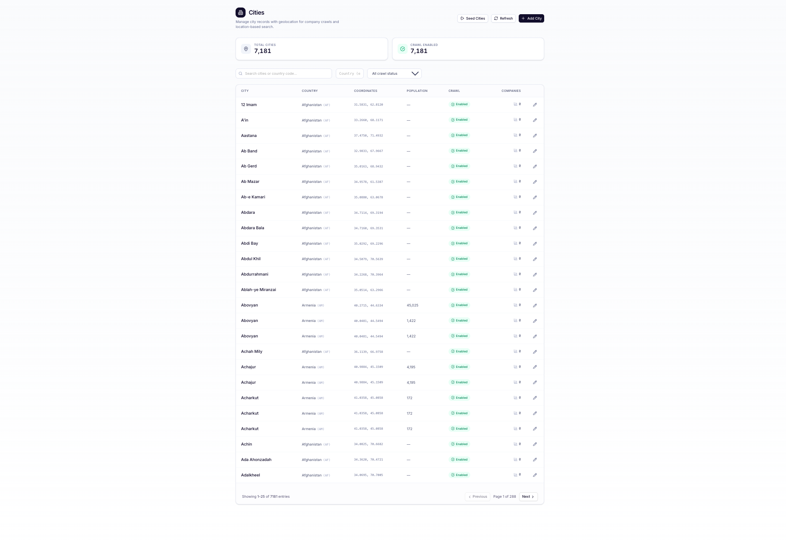](./screenshots/15.png) |

| Screen 16 | Screen 17 |
|---|---|
| [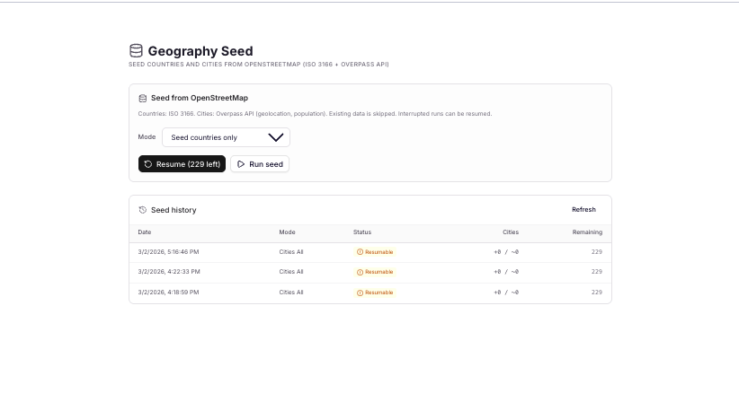](./screenshots/16.png) | [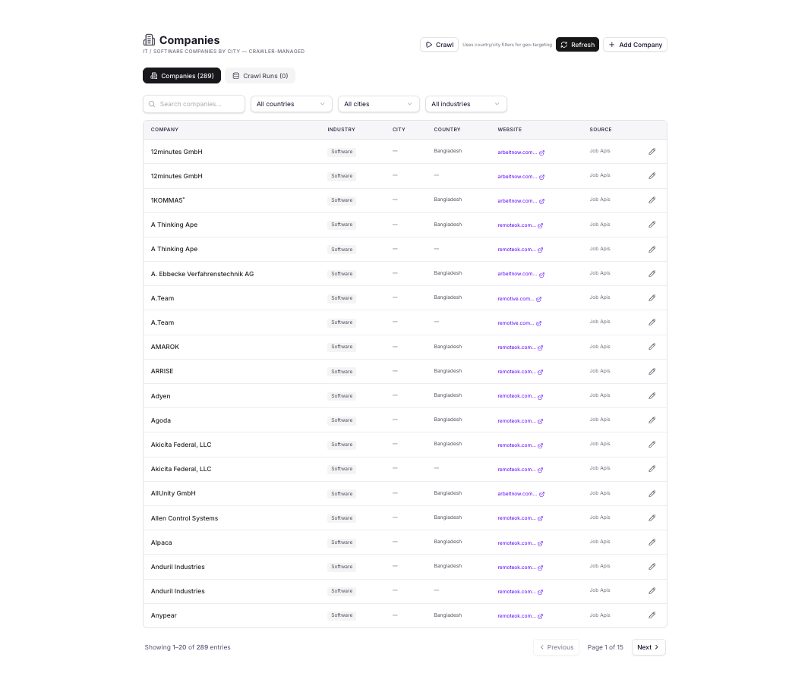](./screenshots/17.png) |

## Prerequisites

- Node.js (LTS recommended) and npm
- A [Sanity](https://www.sanity.io/) project and dataset
- Tokens: read token for the frontend; write token (or read with create) for ingestion (analytics, crawls, geography)

## Environment variables

Copy examples and fill in values:

- [`frontend/.env.example`](frontend/.env.example) — Sanity, optional studio gate, cron, job API keys, scraping, Stripe, SMTP, GitHub, etc.
- [`studio/.env.example`](studio/.env.example) — Studio CLI (`sanity dev` / deploy)

See [`docs/environment-and-deployment.md`](docs/environment-and-deployment.md) for a consolidated reference.

## Local development

From the **repository root**:

```bash
npm install
npm run dev
```

This runs **Next.js** (`frontend`, usually [http://localhost:3000](http://localhost:3000)) and **Sanity Studio** (`studio`, default [http://localhost:3333](http://localhost:3333)) concurrently.

Run only the site:

```bash
npm run dev:next
```

Run only Studio:

```bash
npm run dev:studio
```

### Optional sample data

If your Studio includes a `sample-data.tar.gz` and you use the Sanity CLI from `studio/`:

```bash
npm run import-sample-data
```

(This replaces the target dataset—use only on a safe environment.)

## Build & production

```bash
npm run build
```

Builds the **frontend** workspace (`next build`). Deploy Studio separately with `npx sanity deploy` from [`studio/`](studio/) when you want a hosted editor.

Scheduled crawls and metric recording use **cron** routes under `frontend/app/api/cron/`; configure `CRON_SECRET` and your host’s cron (e.g. Vercel Cron) as described in the ops doc.

## Documentation index

| Document | Contents |
|----------|----------|
| [docs/README.md](docs/README.md) | Doc index and conventions |
| [docs/architecture.md](docs/architecture.md) | Stack, monorepo, request flow |
| [docs/content-and-studio.md](docs/content-and-studio.md) | CMS schema, embedded dashboards, Studio structure |
| [docs/jobs-geography-companies.md](docs/jobs-geography-companies.md) | Job sources, crawls, OSM seed, company pipeline |
| [docs/analytics-and-integrations.md](docs/analytics-and-integrations.md) | Telemetry, GitHub, Stripe, email |
| [docs/api-spec.md](docs/api-spec.md) | HTTP API surface (route map) |
| [docs/environment-and-deployment.md](docs/environment-and-deployment.md) | Env vars, security notes, deploy checklist |

## License

See repository metadata; Studio package may be `UNLICENSED` per [`studio/package.json`](studio/package.json).
