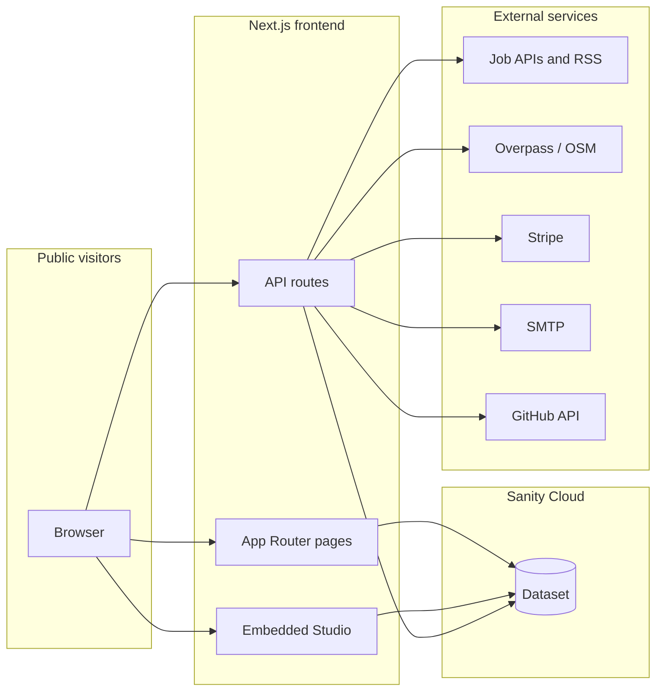

# Architecture

## Overview

Crooked is a **npm workspace monorepo** with two main packages:

1. **`frontend`** — Next.js 15 application using the App Router, React 19, Tailwind CSS 4, and `next-sanity` for content and preview. It serves the public marketing site, serverless API routes, and an embedded Sanity Studio.
2. **`studio`** — Sanity Studio 3 project containing schema definitions (`studio/src/schemaTypes/`). Schemas are the contract for the dataset; the running Studio UI used day-to-day is typically the one **embedded in the frontend** (same origin as the site), while `npm run dev:studio` runs a standalone Studio for schema work.

Shared state is the **Sanity dataset**: the frontend reads via `@sanity/client` (and write paths via a token-backed client), and crawlers/dashboards mutate documents through the same API.

## High-level diagram

## Frontend structure (selected)

| Area | Path | Role |
|------|------|------|
| Public routes | `frontend/app/(content)/` | Home, experience, contact, terms |
| Studio | `frontend/app/studio/` | Embedded Sanity Studio tool route |
| Studio login | `frontend/app/studio-login/` | Password gate when obscure path + secret are set |
| API | `frontend/app/api/` | Analytics, admin proxies, crawlers, cron, webhooks |
| Admin UI | `frontend/components/admin/` | Dashboards mounted from `sanity/structure.ts` |
| Jobs | `frontend/lib/jobs/` | Fetchers, crawler orchestration, types |
| Geography | `frontend/lib/geography/` | Seed orchestration, Overpass, Nominatim helpers |
| Companies | `frontend/lib/companies/` | Company crawl from normalized jobs |
| Sanity helpers | `frontend/sanity/` | `sanity.config.ts`, queries, clients, structure |

## Middleware and Studio routing

`frontend/middleware.ts` supports an **obscure Studio path**:

- If `NEXT_PUBLIC_SANITY_STUDIO_PATH` is set to a non-`studio` value, requests to `/studio` return 404.
- Requests to `/<that-path>` are rewritten internally to `/studio/...` after optional cookie check against `SANITY_STUDIO_ACCESS_SECRET`.

Edge middleware only sees `NEXT_PUBLIC_*` for the path; keep server and public path variables aligned.

## Execution model

- **User requests** hit Next.js pages or API routes (Node serverless on Vercel or local dev).
- **Long-running crawls** use `maxDuration` on relevant routes; cron routes trigger crawls and system metric recording.
- **No separate worker service** in-repo: background work is HTTP-triggered (manual admin POST or scheduled GET).

## Tech stack summary

- Next.js 15, React 19, TypeScript
- Sanity 3 (`@sanity/client`, `next-sanity`, embedded Studio)
- Tailwind 4, Radix UI, Framer Motion, Recharts
- Stripe, Nodemailer, fast-xml-parser (RSS), optional SerpApi
